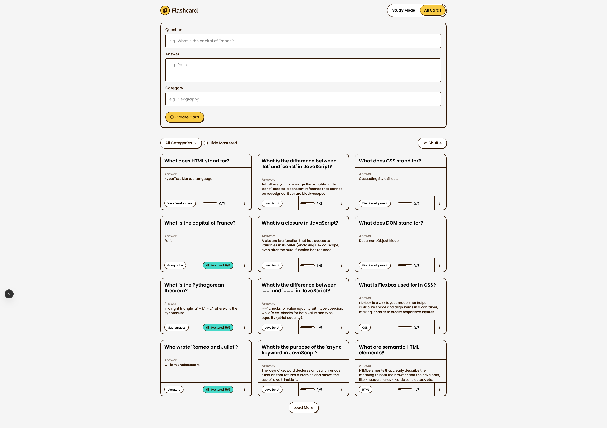

# Frontend Mentor - Flashcard app solution

This is a solution to the [Flashcard app challenge on Frontend Mentor](https://www.frontendmentor.io/challenges/flashcard-app). Frontend Mentor challenges help you improve your coding skills by building realistic projects.

## Table of contents

- [Overview](#overview)
  - [The challenge](#the-challenge)
  - [Screenshot](#screenshot)
  - [Links](#links)
- [My process](#my-process)
  - [Built with](#built-with)
  - [What I learned](#what-i-learned)
  - [AI Collaboration](#ai-collaboration)
- [Author](#author)

## Overview

### The challenge

Users should be able to:

#### Flashcard Management

- Create new flashcards with a question, answer, and category
- Edit existing flashcards to update their details
- Delete flashcards they no longer need
- See form validation messages when trying to submit a card without all fields completed
- View all their flashcards in a grid layout
- See flashcard details including question, answer, category, and mastery progress

#### Study Mode

- Study flashcards one at a time in Study Mode
- Click on a flashcard to reveal the answer
- Mark a flashcard as known by clicking "I Know This" to track mastery progress
- Navigate between flashcards using Previous and Next buttons
- See which card they're currently viewing (e.g., "Card 1 of 40")
- Track mastery progress for each card on a scale of 0 to 5
- Reset progress on a flashcard to start learning it again

#### Filtering & Organization

- Filter flashcards by selecting one or multiple categories
- See the number of cards in each category within the filter dropdown
- Hide mastered cards to focus on cards that still need practice
- Shuffle flashcards to randomize the study order

#### Statistics & Progress

- View study statistics showing total cards, mastered, in progress, and not started counts

#### UI & Navigation

- Toggle between Study Mode and All Cards views
- Load more flashcards when viewing the full card list with more than 12 cards
- See a toast message when a card is created, updated, or deleted
- View the optimal layout for the interface depending on their device's screen size
- See hover and focus states for all interactive elements on the page
- Navigate the entire app using only their keyboard

### Screenshot

### Links

- Solution URL: [GitHub](https://github.com/GFJankavs/fm-flashcard-app)
- Live Site URL: [Add live site URL here](https://your-live-site-url.com)

## My process

### Built with

- Semantic HTML5 markup
- CSS custom properties
- Flexbox
- CSS Grid
- Mobile-first workflow
- [Next.js](https://nextjs.org/) - React framework
- [Tailwind CSS](https://tailwindcss.com/) - A utility-first CSS framework
- [Jest](https://jestjs.io/) - For unit tests (JavaScript Testing Framework)
- [Playwright](https://playwright.dev/) - E2E testing library

### What I learned

I relearned how to write unit and e2e tests using Jest and Playwright, which I had not done in a while.

### AI Collaboration

Describe how you used AI tools (if any) during this project. This helps demonstrate your ability to work effectively with AI assistants.

- What tools did you use (e.g., ChatGPT, Claude, GitHub Copilot)?
  - Claude Code
  - GitHub Copilot
- How did you use them (e.g., debugging, generating boilerplate, brainstorming solutions)?
  - Writing unit and e2e tests
  - Minor bug fixing

## Author

- Frontend Mentor - [@GFJankavs](https://www.frontendmentor.io/profile/GFJankavs)
- Twitter - [@GFJankavs](https://www.twitter.com/GFJankavs)
